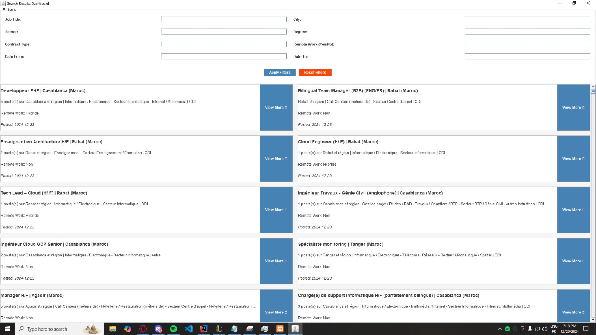
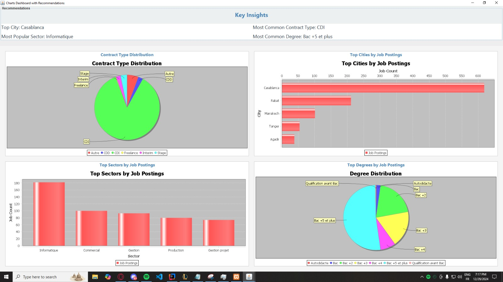
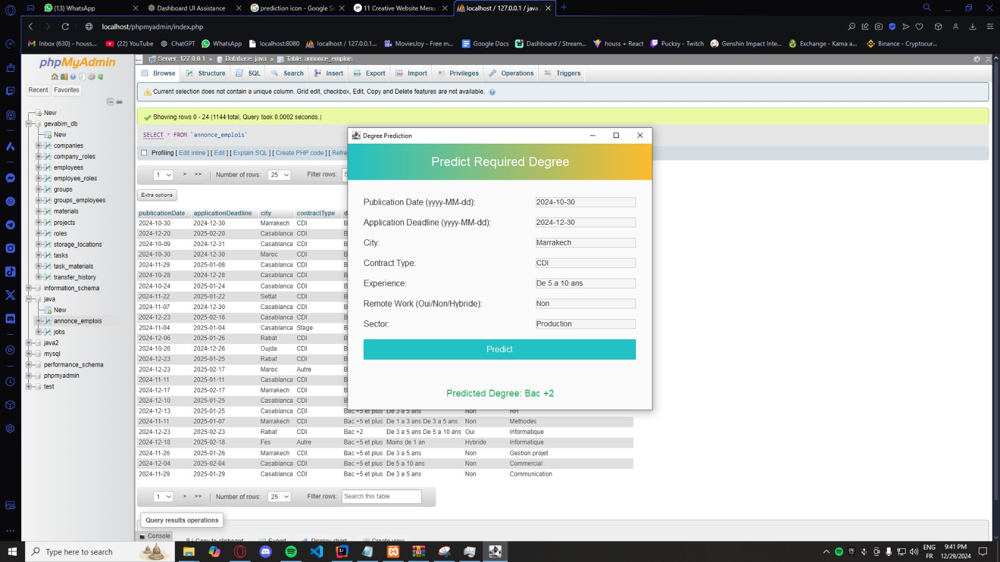
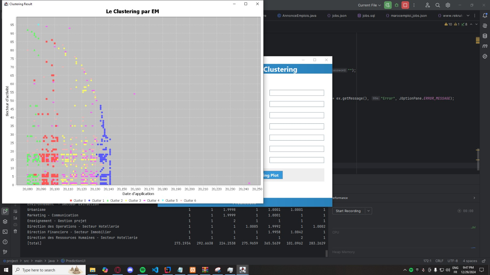

# 📊 Java Job Scraper & Analyzer

A powerful desktop application in Java for scraping, storing, analyzing, and predicting job advertisement data. The application allows users to search job listings based on various filters, visualize trends using charts (JFreeChart), and predict required education levels using machine learning (Weka). All data is stored and queried through a MySQL database.

## ✨ Features

- 🔍 **Job Scraping**: Automatically scrape job listings from online sources
- 🗂️ **Filter & Search**: Filter job ads by title, location, contract type, experience, or keyword
- 📊 **Data Visualization**: Interactive charts for analyzing job distribution by domain, city, contract type, etc.
- 🔎 **Clustering**: Use clustering algorithms to group similar job ads
- 🎯 **ML Predictions**: Predict the expected education level for a given job using Weka models
- 💾 **Database Integration**: Save and retrieve job data via MySQL
- 🖥️ **User Interface**: Easy-to-use Swing GUI

## 🛠️ Tech Stack

- **Language**: Java 8+
- **GUI**: Java Swing
- **Charts**: JFreeChart
- **Database**: MySQL 8.0
- **Machine Learning**: Weka
- **Scraping**: Jsoup
- **Build Tool**: Maven

---

## 🖼️ Screenshots

### 🧩 Main Window Overview
<p align="center">
  
</p>
<p align="center"><em>Central dashboard with navigation and key actions</em></p>

### 🔎 Filter and Display Job Ads
<p align="center">
  
</p>
<p align="center"><em>Search jobs using advanced filters</em></p>

### 📈 Charts & Analytics (JFreeChart)
<p align="center">
  
</p>
<p align="center"><em>Visual representation of data (contract type, location, job domain, etc.)</em></p>

### 🧠 Machine Learning - Predict Education Level
<p align="center">
  
</p>
<p align="center"><em>Use Weka model to predict required education for a job ad</em></p>

### 🧬 Clustering Job Ads
<p align="center">
  
</p>
<p align="center"><em>Apply clustering algorithm to group similar job offers</em></p>

## 📹 Video Demonstrations
### <a href="https://drive.google.com/file/d/1jk1mb2khbwcDi4qRyl7ZO2jK_2wFHNQm/view?usp=drive_link">Demo</a>
---

## 🗄️ MySQL Database Setup

### Create the Database
```sql
CREATE DATABASE job_ads_db;
USE job_ads_db;
```

## 🤖 Machine Learning (Weka Integration)

### Use .arff files generated from job ads
### Train a model using Weka Explorer
### Load the model into the app for predictions

